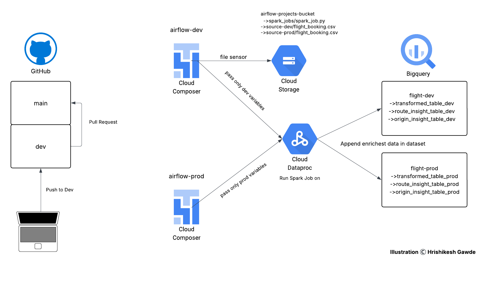

# Flight-Booking-Data-Pipeline-with-Airflow-CICD

## Introduction
This project presents a simple but production-inspired ETL pipeline to automate data engineering workflows. It extracts flight booking data from Google Cloud Storage, transforms it using PySpark on Dataproc Serverless, and loads the enriched results into BigQuery tables. The project integrates CI/CD using GitHub Actions and orchestrates the pipeline with environment-based Airflow DAGs running on Cloud Composer.

## Problem Statement
Flight booking data is often processed manually or using non-automated pipelines. This project demonstrates how a basic ETL flow can be fully automated and environment-driven. The goal is to build a foundational, end-to-end data pipeline that supports both development and production workflows using standard engineering best practices like parameterized DAGs and CI/CD automation.

## Architecture
The architecture involves triggering an Airflow DAG from Cloud Composer via a file sensor that detects uploaded CSVs in Cloud Storage. The DAG then triggers a PySpark job on Dataproc Serverless, which processes and enriches the data and loads it into the respective BigQuery tables. The entire pipeline is CI/CD-enabled using GitHub Actions.

## Technology Used
- Python
- Apache Airflow (Cloud Composer)
- PySpark
- Google Cloud Storage
- Google Cloud Dataproc (Serverless)
- Google BigQuery
- GitHub
- GitHub Actions

## Dataset Used
#### Input Data
`flight_booking.csv`: num_passengers, sales_channel, trip_type, purchase_lead, length_of_stay, flight_hour, flight_day, route, booking_origin, wants_extra_baggage, wants_preferred_seat, wants_in_flight_meals, flight_duration, booking_complete

#### GCS Folder Structure
- airflow-projects-bucket/spark_jobs/spark_job.py
- airflow-projects-bucket/source-dev/flight_booking.csv
- airflow-projects-bucket/source-prod/flight_booking.csv

## Scripts for Project
#### spark_job.py: 
PySpark script that:
- Adds derived columns such as is_weekend, lead_time_category, and booking_success_rate
- Performs aggregations for route and booking origin insights
- Writes transformed and aggregated data to BigQuery
  
#### flight_pipeline_dag.py: 
Parameterized Airflow DAG that:
- Accepts runtime environment variables (dev or prod)
- Uses a FileSensor to detect new files in GCS
- Submits the corresponding Spark job to Dataproc Serverless
- Writes data to BigQuery based on the environment

#### github/workflows/ci-cd.yml: 
When code gets pushed on dev branch GitHub Actions workflow triggered on dev branch deploy and test pipeline in the development environment. On succesul execution of workflow in dev enviornment we send pull request to merge code in main branch.GitHub Actions workflow triggered via pull request merges to the main branch to deploy and execute the production pipeline.

## Output and Impact
### BigQuery Tables
#### Development Environment (flight-dev dataset)
- transformed_table_dev: is_weekend, lead_time_category, booking_success_rate
- route_insight_table_dev: total_bookings, avg_flight_duration, avg_stay_length
- origin_insight_table_dev: total_bookings, success_rate, avg_purchase_lead

#### Production Environment (flight-prod dataset)
- transformed_table_prod: is_weekend, lead_time_category, booking_success_rate
- route_insight_table_prod: total_bookings, avg_flight_duration, avg_stay_length
- origin_insight_table_prod: total_bookings, success_rate, avg_purchase_lead

### Business Impact
- Full automation of an ETL pipeline using CI/CD
- Seamless promotion from dev to prod environment using GitHub workflows
- Ability to derive insights from booking behavior, route popularity, and user preferences
- Provides a scalable foundation to enhance with more complex logic and real-time ingestion in the future

## My Learnings
- Designed my first complete ETL pipeline from scratch using PySpark and BigQuery
- Learned how to orchestrate environment-specific workflows using Airflow with parameterized DAGs
- Gained hands-on experience in implementing CI/CD in data engineering using GitHub Actions
- Understood how to integrate GCP services like Cloud Storage, Dataproc Serverless, and BigQuery
- Built confidence in deploying scalable, maintainable, and production-friendly data pipelines

